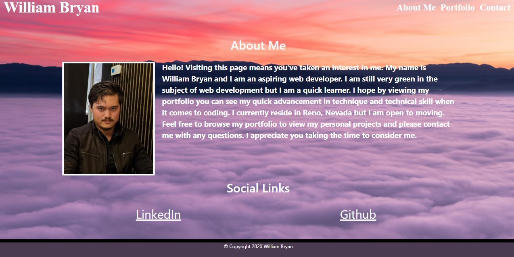
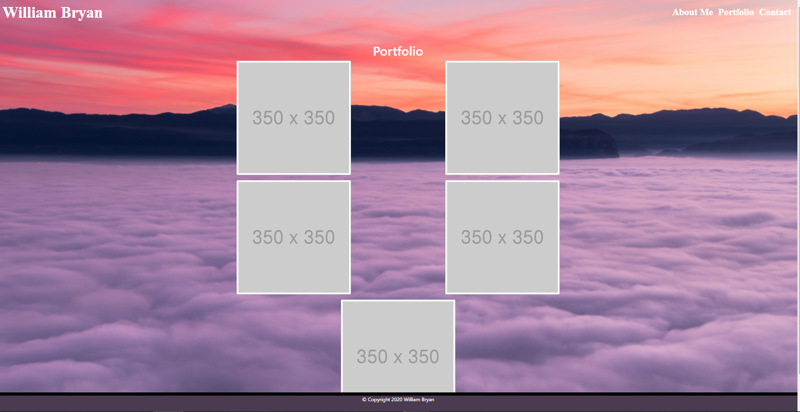

# William Bryan's Portfolio
----------------------
## Description

Simple portfolio designed for homework 2.

## Prerequites

Item is entirely in HTML and CSS so none needed.

## Technologies Used

- HTML
- CSS

## Website Appearance

### Landing page

### Contact Page

### Portfolio

## Deployed Link
https://weilibryan.github.io/Bootstrap-Portfolio/

## Code Snippet
`

      

        <section class="row">

          <!-- Header -->
          

            <h1>Portfolio</h1>
          

        </section>

          <!-- First Row Portfolio Photos -->
        <section class="row">

          <figure class="col-sm-12 col-md-6 col-sm-6">
            
          </figure>

          <figure class="col-sm-12 col-md-6 col-sm-6">
            
          </figure>

        </section>

          <!-- Second -->
        <section class="row">

          <figure class="col-sm-12 col-md-6 col-sm-6">
            
          </figure>

          <figure class="col-sm-12 col-md-6 col-sm-6">
            
          </figure>

        </section>

          <!-- Third -->
        <section class="row">

          <figure class="col-xs-12">
            
          </figure>

        </section>
  
      

    `

## Authors

1. **William W. Bryan** 
- [Github](https://github.com/WeiLiBryan)
- [LinkedIn](https://www.linkedin.com/in/william-bryan-72730019a/)

## License

This project is licensed under the MIT License

## ACKNOWLEDGEMENTS

-[unsplash.com (Background Image)](https://unsplash.com/photos/In7RdU6QY2M)
-[placehold.jp (Portfolio Placeholder Images)](http://placehold.jp/en.html)
-[Bootstrap](https://getbootstrap.com/)